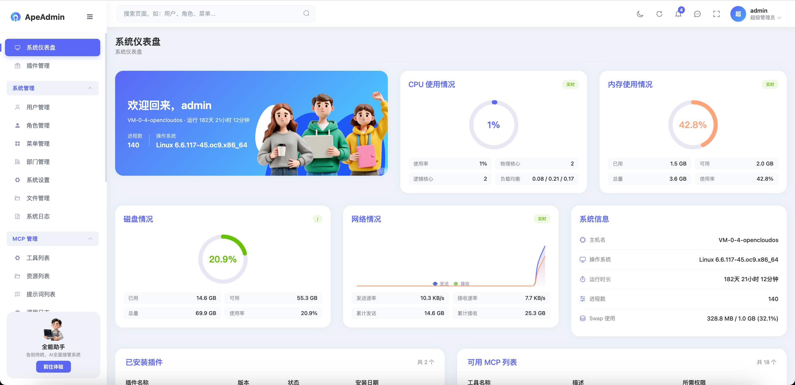
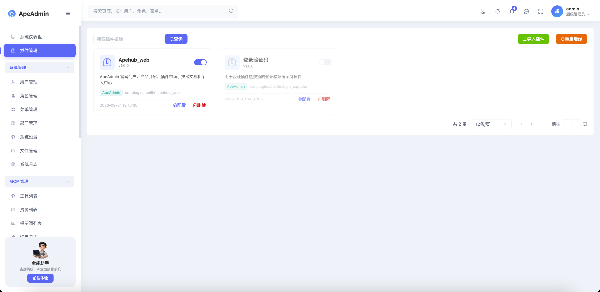
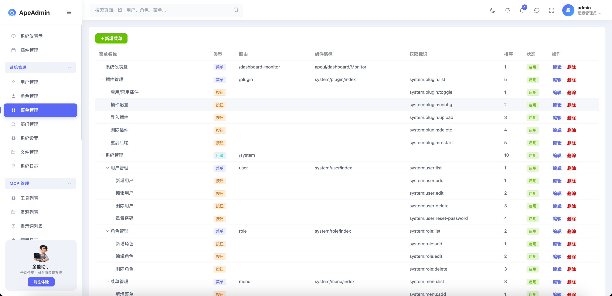
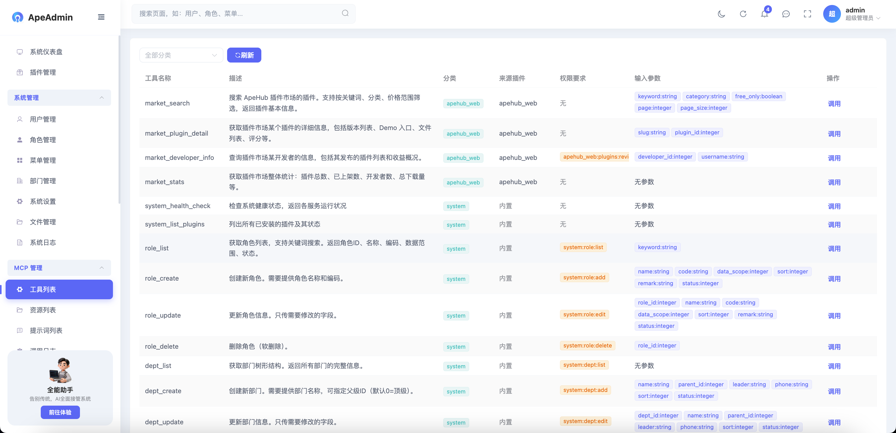

<div align="center">
  <br/>
  
  <h1>ApeAdmin-Gin</h1>
  <p> ApeAdmin 的 Go 版本 · 面向高并发场景的 AI 后台管理框架</p>
</div>

<p align="center">
  <a href="http://apehub.finecv.cn/apehub-web">apeadmin官网</a> ·
  <a href="http://apehub.finecv.cn/apehub-web/plugins.html">插件市场</a> ·
  <a href="http://apehub.finecv.cn/apehub-web/docs-portal">开发文档</a> ·
  <a href="https://apehub.finecv.cn/admin">demo体验</a> ·
  <a href="#功能特性">功能</a> ·
  <a href="#架构">架构</a> ·
  <a href="#配置说明">配置</a> ·
</p>

<p align="center">
  
  
  
  
  
</p>

---

> **本项目由 AI 驱动开发，人工负责产品与质量。** ApeAdmin-Gin 在 AI 辅助下高效迭代：人类开发者负责产品方向、架构评审、质量验证与最终决策，AI 负责加速实现、测试和文档工作。

---

ApeAdmin-Gin 是 ApeAdmin 的 Go 版本，面向高并发场景打造的后台开发框架，基于 Gin + GORM + Vue3 搭建平台化管理底座，原生为 AI Agent 能力调用做适配。

Go 语言天生的高并发模型（goroutine + 极低的内存占用）让本框架特别适合**高并发项目**：万级 QPS 的业务系统、多实例横向扩展集群、资源受限的轻量部署环境。编译产出单个可执行文件，无运行时依赖，从开发到生产部署的体验极其简洁。

项目支持插件化开发，拥有完善的插件社区生态；内置 RBAC 权限管控、MCP 网关、审计日志等企业级基础能力。框架集成 MCP 工具网关，可把系统底座和业务插件的功能直接封装为标准化 AI 工具供 Agent 调用，实现传统业务系统与大模型智能体的无缝打通，同时保留完整的后台管理能力，帮助开发者快速搭建兼具业务管理与 AI 工具输出能力的应用。

你可以把它理解为一个"单二进制 + 可插拔扩展"的中后台框架——底座提供权限、菜单、日志等基础设施，业务功能以插件形式独立开发和部署，同时通过 MCP 网关将管理能力暴露给 AI Agent 调用。项目采用 MIT 开源协议。

## 功能特性

### 高性能底座

为高并发场景而生：

- **单二进制部署** —— `go build` 产出单个可执行文件，无运行时依赖，无解释器开销，部署即复制
- **原生高并发** —— Go goroutine 模型天然支持数万并发连接，单机即可承载高 QPS 业务
- **低内存占用** —— 相比解释型语言框架内存占用降低数倍，资源受限环境友好
- **连接池调优** —— GORM 数据库连接池（MaxOpenConns / MaxIdleConns）可配置，适配高并发数据库访问
- **并发隔离** —— MCP 工具调用带并发信号量上限，单工具过载不影响整体服务
- **快速启动** —— 毫秒级启动速度，容器编排 / 弹性伸缩场景即扩即用

### RBAC 权限体系

- **五表模型** —— 用户 / 角色 / 菜单 / 部门 + 关联表，标准 RBAC 基础设施
- **四层权限** —— 免登录 → 仅登录 → 规则鉴权 → 数据范围（本人 / 本部门 / 本部门及以下 / 全部）
- **菜单三类型** —— 目录(M) / 菜单(C) / 按钮(F)，支持无限层级树形结构
- **超管通配** —— 超级管理员自动拥有所有权限，普通用户按角色菜单分配，支持 `*` 权限通配
- **权限中间件** —— `RequirePermission` 中间件按路由校验按钮级权限，前端 `v-permission` 指令联动控制

### 插件化架构

- **三级插件体系** —— L1 编译内置（`init()` 自注册）/ L2 声明式 ZIP（manifest 清单）/ L3 外部进程（预留扩展）
- **完整生命周期** —— `OnLoad → Install → Register → Unregister → Uninstall → OnUnload`，支持热启用禁用
- **ZIP 安全装载** —— 上传 ZIP 校验：zip bomb 防护（解压总量上限）、条目数上限、拒绝符号链接，校验通过后事务式写入数据库
- **菜单/数据注入** —— ZIP 包可携带 `menu.json` 注入菜单树、`seed.sql` 注入预置数据
- **能力注册** —— 插件可注册路由（公开/需登录）、MCP 工具、事件监听器
- **插件市场** —— 与 ApeAdmin 插件市场生态互通，浏览、搜索、安装社区插件

### 事件总线

- **松耦合通信** —— 插件间通过事件总线解耦，支持 `app_startup / app_shutdown / db_ready / user_login` 等事件
- **异步分发** —— 事件处理器以 goroutine 异步执行，不阻塞业务主流程

### MCP 网关

将底座与插件的管理能力对外暴露为 AI Agent 可调用的工具：

- **三原语** —— Tools（工具调用）/ Resources（资源读取）/ Prompts（模板渲染）
- **RBAC 过滤** —— 每个工具可声明 `RequiredPermissions`，AI Agent 只能看到并调用有权限的工具
- **超时与并发隔离** —— 单次工具调用超时控制（默认 30s）+ 单工具并发信号量上限
- **审计日志** —— 每次工具调用自动记录请求、响应、耗时、调用者，支持后台筛选检索
- **插件扩展** —— 插件通过 `mcp.Registrar` 注册工具，实现能力级对外开放

内置 MCP 工具：

| 工具 | 说明 |
|------|------|
| `system_health_check` | 系统健康检查 |
| `role_list` | 角色列表（分页） |
| `role_create` | 角色管理（需权限） |

### AI 对话

- **多模型支持** —— DeepSeek / 通义千问 / 智谱 GLM / OpenAI / 自定义端点，OpenAI 兼容接口
- **流式 SSE** —— 流式输出 + Markdown 实时渲染 + 代码高亮
- **Function Calling** —— AI 可调用 MCP 工具完成管理操作，工具调用循环受 RBAC 权限控制
- **密钥管理** —— 后台管理 AI 供应商密钥，加密存储（密钥派生自 JWT Secret）
- **会话持久化** —— 会话与消息落库，支持历史会话续聊、重命名与删除

### 安全体系

- **双令牌 JWT** —— access token（24h）+ refresh token（7d）双令牌机制，HS256 算法白名单防算法替换攻击
- **令牌失效机制** —— 用户改密即失效旧令牌（TokenVersion）；黑名单机制登出即失效，多实例部署可配 Redis 共享
- **登录防爆破** —— 连续失败 5 次锁定 30 分钟（窗口 15 分钟，可配置）
- **API 限流** —— 按 IP 维度限流（默认每 IP 每分钟 300 次，burst 50），登录接口独立限流（每分钟 10 次），高并发下保护后端不被打挂
- **上传白名单** —— 文件上传扩展名白名单校验，单文件大小上限
- **生产密钥熔断** —— 生产模式（debug=false）检测到默认 `jwt.secret` 直接拒绝启动

### 审计日志

- **请求链路追踪** —— RequestID 中间件全局唯一请求 ID，贯穿日志
- **操作日志** —— 异步队列缓冲写入（默认 1024），高并发下不阻塞请求，支持按模块、时间、用户筛选
- **结构化日志** —— Zap JSON 格式，支持控制台 / 文件双输出
- **优雅关闭** —— 三阶段停机（停止接收请求 5s → 插件卸载 + 事件 5s → 日志 drain + DB 断连 5s）

## 技术栈

| 层 | 技术 |
|---|---|
| 后端 | Gin v1.12 + GORM v1.31 |
| 前端 | Vue 3.5 + Vite + TypeScript + Element Plus（复用 apeadmin 前端） |
| 配置 | Viper v1.21（YAML + 环境变量覆盖 `GA_` 前缀） |
| 日志 | Zap v1.28（结构化 JSON） |
| 数据库 | MySQL / SQLite 双驱动自动切换 |
| 缓存 | Redis（可选，多实例令牌黑名单共享） |
| 认证 | JWT v5（access/refresh 双令牌 + TokenVersion + 黑名单） |
| AI 协议 | MCP (Model Context Protocol) — 工具 / 资源 / 提示词 |
| AI 模型 | DeepSeek / 通义千问 / 智谱 GLM / OpenAI（OpenAI 兼容接口） |

## 快速开始

### 在线体验

无需自己搭建，直接访问线上演示环境（ApeAdmin 生态共用）：

- **案例地址**：<https://apehub.finecv.cn/admin>
- **测试账号**：`ceshi110`
- **密码**：`ceshi110`

> 测试账号为只读访客（viewer）角色，仅可查看各模块数据，无增删改权限。

### 本地开发

```bash
# 1. 编译
go build ./...

# 2. 启动（默认 SQLite，端口 8001）
go run cmd/server/main.go

# 默认管理员
# 账号: admin  密码: admin123
```

打开 `http://localhost:8001`，默认管理员账号：

- **账号**：`admin`
- **密码**：`admin123`

> 生产环境必须修改 `configs/config.yaml` 中的 `jwt.secret`，否则 debug=false 时拒绝启动。

### 前端接入

复用 apeadmin 的 Vue3 前端，两种接入方式：

1. **SPA 托管** —— 将前端构建产物放到 `frontend/dist`（对应配置 `app.spa_dir`），后端单端口同时提供 API 与前端页面，单二进制即可交付完整系统
2. **前后端分离** —— 前端 `npm run dev`（默认 5173），后端 8001，CORS 白名单已默认包含 `localhost:5173`

### 配置覆盖

环境变量以 `GA_` 前缀覆盖 YAML 配置（`.` 转 `_`）：

```bash
# 切换 MySQL
GA_DATABASE_TYPE=mysql GA_DATABASE_HOST=127.0.0.1 GA_DATABASE_DBNAME=apeadmin_gin go run cmd/server/main.go

# 高并发生产：开启 Redis 共享令牌黑名单
GA_REDIS_ENABLED=true GA_REDIS_URL=redis://localhost:6379/1 go run cmd/server/main.go
```

### 默认体验路径

1. 登录后台（`admin` / `admin123`）
2. 系统管理 → 用户 / 角色 / 菜单 / 部门 / 插件管理 / 日志 / 设置
3. MCP 管理 → 工具 / 资源 / 提示词 / 调用审计
4. AI 助手 → 添加模型供应商后即可对话

## 架构

ApeAdmin-Gin 是一个前后端分离的单体应用（可选 SPA 托管），后端插件化扩展，启动时自动迁移建表 + 种子数据：

```
apeadmin-gin/
  cmd/server/                    # 程序入口
    main.go                      # flag 解析 + bootstrap.Run
  configs/
    config.yaml                  # 全局配置（app/database/jwt/mcp/plugin/security...）
  internal/
    bootstrap/                   # 启动编排
      app.go                     # 配置→日志→DB→种子→插件→路由→优雅关闭
    api/                         # HTTP 路由 + Handler
      router.go                  # 路由注册（公开/认证/权限三级分组）
      auth.go                    # 认证（登录/登出/刷新/用户信息）
      user.go                    # 用户管理
      crud.go                    # 角色/菜单/部门泛型 CRUD
      plugin.go                  # 插件管理（列表/启停/上传/删除）
      mcp.go                     # MCP 管理（工具/资源/提示词/审计）
      ai_provider.go             # AI 供应商密钥管理
      ai_chat.go                 # AI 对话 + 会话持久化
      ai_chat_stream.go          # AI 流式 SSE 对话
      ai_tools.go                # AI Function Calling 工具
      dashboard.go               # 仪表盘统计
    config/                      # Viper 配置结构体
    core/                        # 核心组件
      db.go                      # GORM 初始化（MySQL/SQLite + 连接池）
      jwt.go                     # JWT 签发/解析（算法白名单）
      tokenstore.go              # 令牌黑名单
      auditqueue.go              # 操作日志异步队列
      logger.go                  # Zap 日志
      seed.go                    # 种子数据（超管/菜单）
      container.go               # 全局容器
    middleware/                  # 中间件链
      jwt_auth.go                # 登录认证
      login_guard.go             # 登录防爆破
      permission.go              # 按钮级权限
      rate_limit.go              # IP 限流
      operation_log.go           # 操作日志
      request_id.go              # 请求链路追踪
      cors.go / recovery.go / logger.go
    model/                       # GORM 模型（sys_ 前缀）
      rbac.py → rbac.go          # RBAC 五表
      plugin.go                  # 插件记录
      mcp.go                     # MCP 工具/审计
      log.go / ai.go             # 日志 / AI 供应商与会话
    schema/                      # 请求/响应 DTO
    dal/                         # 数据访问层
      rbac.go                    # 权限查询
      datascope.go               # 数据范围 GORM Scope
      system.go                  # 系统查询
    service/                     # 业务逻辑层（用户/权限）
    mcp/                         # MCP 协议体系
      manager.go                 # 工具/资源/提示词管理 + RBAC 过滤 + 审计
      builtin.go                 # 内置工具/资源/提示词
    plugin/                      # 插件系统
      interface.go               # Plugin 接口
      registry.go                # 全局注册表（init() 自注册）
      manager.go                 # 发现/加载/卸载/事件
      eventbus.go                # 事件总线
      loader_l2.go               # L2 ZIP 插件加载（安全校验/菜单/seed 注入）
      zipguard.go / ziputil.go / jsonutil.go
    pkg/                         # 公共工具
      response/                  # 统一响应
      pagination/                # 分页
      tree/                      # 树形结构
      utils/                     # password/crypto
  uploads/                       # 上传文件目录（插件包 / 文件）
  logs/                          # 日志文件
```

### 设计原则

1. **单二进制部署** —— `go build` 产出单个可执行文件，内置 SPA 静态托管能力，从开发到生产部署体验极简
2. **高并发友好** —— 连接池、限流、异步日志队列、并发信号量等生产级设计开箱即用，单机高性能，多实例可横向扩展
3. **编译内置 + 声明式扩展** —— 内置插件编译期注册（零运行时开销），L2 插件通过 ZIP 清单声明式安装，两者共存互不影响
4. **双数据库驱动** —— 开发用 SQLite 零配置启动，生产用 MySQL，通过 `database.type` 切换
5. **权限贯穿 AI** —— MCP 工具调用和 AI Function Calling 均受 RBAC 权限控制，AI Agent 只能操作有权限的资源
6. **安全默认值** —— 默认密钥熔断、ZIP 上传防护、登录防爆破、IP 限流开箱即用
7. **优雅停机** —— 三阶段关闭保障请求、插件与数据日志不丢失，滚动更新 / 弹性伸缩场景数据安全

## 插件开发

### L1 内置插件

在任意包中实现 `plugin.Plugin` 接口，并在 `init()` 中注册：

```go
package hello

import (
    "github.com/gin-gonic/gin"
    "apeadmin-gin/internal/mcp"
    "apeadmin-gin/internal/plugin"
)

// 实现 Plugin 接口
type HelloPlugin struct{}

func (p *HelloPlugin) Name() string        { return "hello" }
func (p *HelloPlugin) DisplayName() string { return "Hello 插件" }
func (p *HelloPlugin) Description() string { return "演示插件：注册路由与 MCP 工具" }
func (p *HelloPlugin) Version() string     { return "1.0.0" }
func (p *HelloPlugin) Author() string      { return "Your Name" }
func (p *HelloPlugin) Dependencies() []string { return nil }

func (p *HelloPlugin) OnLoad() error { return nil }
func (p *HelloPlugin) Install() error { return nil }

// 注册业务路由与 MCP 工具
func (p *HelloPlugin) Register(r *plugin.PluginRouter) error {
    // 公开路由
    r.Public.GET("/hello", func(c *gin.Context) {
        c.JSON(200, gin.H{"msg": "Hello from ApeAdmin-Gin!"})
    })
    // 需登录路由
    r.Authed.GET("/hello/me", func(c *gin.Context) { /* ... */ })
    // MCP 工具（暴露给 AI Agent）
    r.MCP.RegisterTool(&mcp.ToolEntry{
        Name:        "hello_greet",
        Description: "向指定用户问候",
        InputSchema: map[string]interface{}{
            "type": "object",
            "properties": map[string]interface{}{
                "name": map[string]interface{}{"type": "string"},
            },
            "required": []string{"name"},
        },
        Handler: func(args map[string]interface{}) (interface{}, error) {
            return map[string]interface{}{"message": "Hello, " + args["name"].(string) + "!"}, nil
        },
    })
    return nil
}

func (p *HelloPlugin) Unregister() error { return nil }
func (p *HelloPlugin) Uninstall() error  { return nil }
func (p *HelloPlugin) OnUnload()         {}

func init() {
    plugin.Register(&HelloPlugin{})
}
```

### L2：声明式 ZIP 插件

无需编写 Go 代码，ZIP 包内包含：

```
my-plugin-1.0.0/
  manifest.json        # 插件声明（name/version/description/author）
  menu.json           # 可选：菜单树注入
  seed.sql            # 可选：预置数据 SQL
  api/                # 可选：预留外部进程逻辑（L3）
```

后台「插件管理 → 上传」即可安装，系统会自动执行 ZIP 安全校验（zip bomb / 条目数 / 符号链接）并通过事务写入。

### 事件类型

| 事件 | 触发时机 |
|------|----------|
| `app_startup` | 应用启动 |
| `app_shutdown` | 应用关闭 |
| `db_ready` | 数据库初始化完成 |
| `user_login` | 用户登录 |

```go
pluginMgr.EventBus().Subscribe(plugin.EventUserLogin, func(ctx context.Context, payload interface{}) {
    // 用户登录后处理（异步 goroutine）
})
```

## 配置说明

配置文件为 `configs/config.yaml`，可用 `GA_` 前缀环境变量覆盖（如 `GA_DATABASE_TYPE=mysql`）：

| 配置项 | 默认值 | 说明 |
|--------|--------|------|
| `app.port` | 8001 | HTTP 监听端口 |
| `app.debug` | true | 调试模式（生产 false，并强制修改 JWT 密钥） |
| `app.spa_dir` | frontend/dist | 前端 SPA 静态目录（为空则关闭托管） |
| `database.type` | sqlite | 数据库类型 (sqlite / mysql) |
| `database.host/port/user/password/dbname` | — | MySQL 连接信息 |
| `database.max_open_conns` | 50 | 最大打开连接数（高并发按需调大） |
| `database.auto_migrate` | true | 自动建表（生产建议 false 走迁移） |
| `redis.enabled` | false | 是否启用 Redis（多实例令牌共享） |
| `jwt.secret` | change-me-in-production... | JWT 签名密钥（生产必须修改） |
| `jwt.expire_minutes` | 1440 | access token 有效期（分钟） |
| `jwt.refresh_expire_days` | 7 | refresh token 有效期（天） |
| `jwt.blacklist_enabled` | true | 登出/改密黑名单失效 |
| `cors.origins` | localhost:5173,8000 | CORS 白名单 |
| `mcp.enabled` | true | 是否启用 MCP 网关 |
| `mcp.timeout` | 30 | 单次工具调用超时（秒） |
| `mcp.max_concurrency` | 10 | 单工具并发上限 |
| `plugin.enabled` | true | 是否启用插件系统 |
| `plugin.zip_guard.*` | 50MB / 200MB / 2000 条 | ZIP 上传防护（包大小/解压总量/条目数） |
| `super_admin.username` | admin | 超管用户名 |
| `super_admin.password` | admin123 | 超管密码 |
| `security.login_guard.*` | 5 次 / 15 分钟 / 30 分钟 | 登录防爆破 |
| `security.rate_limit.*` | 300 / 50 | API 限流（每 IP 每分钟 / burst） |
| `log.level` | info | 日志级别（debug/info/warn/error） |

### AI 模型配置

在管理后台 → AI 助手 → 模型密钥管理中添加：

| 供应商 | 默认模型 | Base URL |
|--------|----------|----------|
| DeepSeek | deepseek-chat | `https://api.deepseek.com` |
| 通义千问 | qwen-plus | `https://dashscope.aliyuncs.com/compatible-mode/v1` |
| 智谱 GLM | glm-4-flash | `https://open.bigmodel.cn/api/paas/v4` |
| OpenAI | gpt-4o-mini | `https://api.openai.com/v1` |
| 自定义 | — | 任意 OpenAI 兼容端点 |

## 系统截图

<table>
  <tr>
    <td width="50%" align="center">
      <br/>
      <sub><b>仪表盘</b></sub>
    </td>
    <td width="50%" align="center">
      <br/>
      <sub><b>插件管理</b></sub>
    </td>
  </tr>
  <tr>
    <td width="50%" align="center">
      <br/>
      <sub><b>权限管理</b></sub>
    </td>
    <td width="50%" align="center">
      <br/>
      <sub><b>MCP管理</b></sub>
    </td>
  </tr>
</table>

## 贡献指南

欢迎贡献！

### 如何贡献

1. **Fork** 仓库
2. 克隆你的 fork：
   ```bash
   git clone https://github.com/<你的用户名>/ApeAdmin-Gin.git
   cd ApeAdmin-Gin
   ```
3. 创建分支：
   ```bash
   git checkout -b feat/your-feature
   ```
4. 修改代码，确保能编译通过：
   ```bash
   go build ./...
   ```
5. 清晰地写 commit：
   ```bash
   git commit -m "feat: add xxx support"
   ```
6. **Push** 并向 `master` 分支提交 **Pull Request**

### 分支命名

| 前缀 | 用途 |
|------|------|
| `feat/` | 新功能 |
| `fix/` | Bug 修复 |
| `refactor/` | 重构（不改变行为） |
| `docs/` | 仅文档 |
| `chore/` | 构建、CI、工具链 |

### 约定

- 插件保持独立，不直接依赖其他插件
- 破坏性操作必须需要用户确认
- API 遵循 RESTful 风格，前缀 `/api/v1`
- 提交前确保 `go build ./...` 通过

## 社区交流

---

用微信扫描下方二维码联系作者加入 ApeAdmin 用户群，反馈问题、分享使用心得，和其他用户、维护者一起交流：

<p align="center">
  
</p>

## License

MIT
